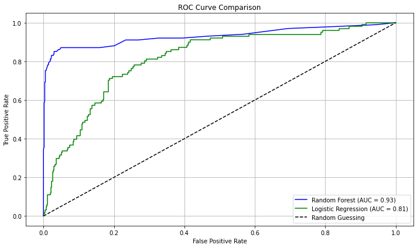

# Overview
Most telecommmunication companies tend to be affected by churn. High churn which basically means many customers dont stick around very long tends to have affect these companies. Customer churn has several negative effects on telecom companies. These include reduced revenue, increased customer acquisition costs, and potential damage to brand reputation. Additionally, high churn rates can lead to a decrease in overall profitability and market share.

# Business understanding 
Syria Tel Company tends to face this problems and it tends to reduce the amount of revenue lost due to churn.The aim is to predict patterns that tend to 
influence the customer behaviour so that they can handle churn and be able to able to build the brand reputation and increase profits being generated and 
overal market share.

# Objectives 
-  Use models to achieve better profitability
-  build a classifier to predict customer behaviour
-  Come up wuth recommendations to solve this kind of problem

# Modeling 
To check on model performance i will do a logistic regression as the baseline model

To check on model performance i will do a logistic regression as the baseline model
X = df.drop(columns=['churn'])  # Drop the target column to create the feature matrix
y = df['churn']                 # Set the target variable
#train-test split
X_train, X_test, y_train, y_test = train_test_split(X,y, test_size=0.2, random_state=42)
scaler = StandardScaler()

# Step 3: Automatically identify numerical columns to scale (excluding object/bool types)
numerical_cols = X.select_dtypes(include=['int64', 'float64']).columns.tolist()

# Step 4: Initialize the scaler
scaler = StandardScaler()

# Step 5: Fit the scaler on the training data
X_train_scaled = X_train.copy()
X_train_scaled[numerical_cols] = scaler.fit_transform(X_train[numerical_cols])

# Step 6: Apply the same transformation to the test data
X_test_scaled = X_test.copy()
X_test_scaled[numerical_cols] = scaler.transform(X_test[numerical_cols])
#checking of imbalance 
class_distribution = df.iloc[:,-1].value_counts()
class_distribution
# Logistic regression
# Baseline Logistic Regression 
model = LogisticRegression(solver='liblinear', max_iter=1000, class_weight='balanced', random_state=42)
model.fit(X_train_scaled, y_train)

# Predictions
y_pred = model.predict(X_test_scaled)
y_proba = model.predict_proba(X_test_scaled)[:, 1]

# Confusion matrix
confmat = confusion_matrix(y_test, y_pred)
display = ConfusionMatrixDisplay(confusion_matrix=confmat, display_labels=model.classes_)
display.plot(cmap='Blues')
plt.title("Confusion Matrix - Baseline Logistic Regression")
plt.show()

# Evaluation
print(classification_report(y_test, y_pred))
print("Accuracy:", accuracy_score(y_test, y_pred))
print("ROC AUC Score:", roc_auc_score(y_test, y_proba))
- Overall Accuracy: 75% — Not bad, but doesn't say much due to imbalance.

- ROC AUC Score: 0.81 — Solid, indicating the model separates classes well overall.

- Churn Precision is low (0.35) — Meaning: of all the customers predicted to churn, only 35% actually do.

- Churn Recall is decent (0.75) — You're catching 77% of actual churners — which is typically more important in churn prediction.
# Dession trees
# Initialize the Decision Tree model with class_weight for imbalance handling
dt_model = DecisionTreeClassifier(random_state=42, class_weight='balanced')

# Train the model
dt_model.fit(X_train_scaled, y_train)

# Make predictions
y_pred_dt = dt_model.predict(X_test_scaled)
y_proba_dt = dt_model.predict_proba(X_test_scaled)[:, 1]

# Evaluate performance
print("Classification Report (Decision Tree):\n", classification_report(y_test, y_pred_dt))
print("Accuracy (Decision Tree):", accuracy_score(y_test, y_pred_dt))
print("ROC AUC Score (Decision Tree):", roc_auc_score(y_test, y_proba_dt))
# Random forest
rf_model = RandomForestClassifier(random_state=42, class_weight='balanced')

# train the model
rf_model.fit(X_train_scaled, y_train)

#make predictions
y_pred_rf = rf_model.predict(X_test_scaled)
y_proba_rf = rf_model.predict_proba(X_test_scaled)[:, 1]

# Performance evaluation
print("Classification Report (Random Forest):\n", classification_report(y_test, y_pred_rf))
print("Accuracy (Random Forest):", accuracy_score(y_test, y_pred_rf))
print("ROC AUC Score (Random Forest):", roc_auc_score(y_test, y_proba_rf))
- Overall Accuracy: 95% - The model correctly predicts churn for nearly 95% of customers. Accuracy alone can be misleading in imbalanced datasets. Deeper class-specific metrics will give more insights

- ROC AUC Score: 0.93 — Indicates excellent overall classification ability. 
- Churn Precision (0.96) —  When the model predicts a churner, it is usually correct.
- churn Recall: 0.69 → It misses about 31% of actual churners.

Random forest is the better classification model basing on the precision, f1_score and the ROC AUC score. This then prompts to ploting for feature importance to help draw better conclusions.

# Model comparison ( Logistic and Random Forest)

-  Random Forest is the stronger overall model - Higher accuracy, ROC AUC, precision, and F1-score. It is also much better at correctly classifying non-churners (class 0) and making precise churn predictions.
It is also shown to be the better model from the ROC curve. The random forest curve is more to the left(closer to the y axis) thus depicting a better model.

- Logistic Regression sacrifices precision for recall - Catches more churners (higher recall) but wrongly flags many loyal customers (low precision).Lower accuracy and overall discrimination (AUC).

- Logistic Regression may trigger unnecessary actions - With 35% precision, 65% of predicted churners are actually loyal — leading to wasted retention costs.

- Random Forest offers a better balance - It still catches a large portion of churners (69% recall) but with very high confidence (96% precision). More reliable for making data-driven business decisions.
# Conclusions
Basing the Random forest predictions, the most important features that can be used to predict customer churn are customer service calls, total day charge, total day minutes and the international plan. 

The features that will not be quite reliable in predicting customer churn are total evening calls, number of voice mail messages and the voce mail plan.
# Recommendations 

### Recommendations to solve churn
- Customer service calls is the most important churn driver.  
Reduce repeat or unresolved issues by: Improving agent training, Offering callbacks or quicker resolution paths, Monitoring NPS after support calls

### Review International Plan Pricing
- Customers with international plans are significantly more likely to churn. Re-evaluate pricing or improve value (e.g., bundle with discounts or extra minutes).

### Engage High Usage Customers
- Customers with high daytime usage or charges are more likely to churn. These may be valuable but frustrated users—consider: Usage-based loyalty perks, Targeted feedback surveys, Personalized billing review sessions

### Launch a Churn Prevention Campaign
- Focus on customers who: Have an international plan, Had high daytime charges.
- These customers are your top churn risk—prioritize them in retention.

### Adopt Random Forest for Churn Prediction

Random Forest showed the best performance in accuracy (95%), precision (96%), and AUC (0.93).

It provides reliable predictions with fewer false positives, helping target actual churners and reducing wasted retention spending.

###  Prioritize Targeted Retention
Focus retention resources (discounts, offers, loyalty programs) on customers with high churn probability and valuable usage patterns (e.g., high day charges).

Avoid blanket offers—use model predictions to retain only likely churners.